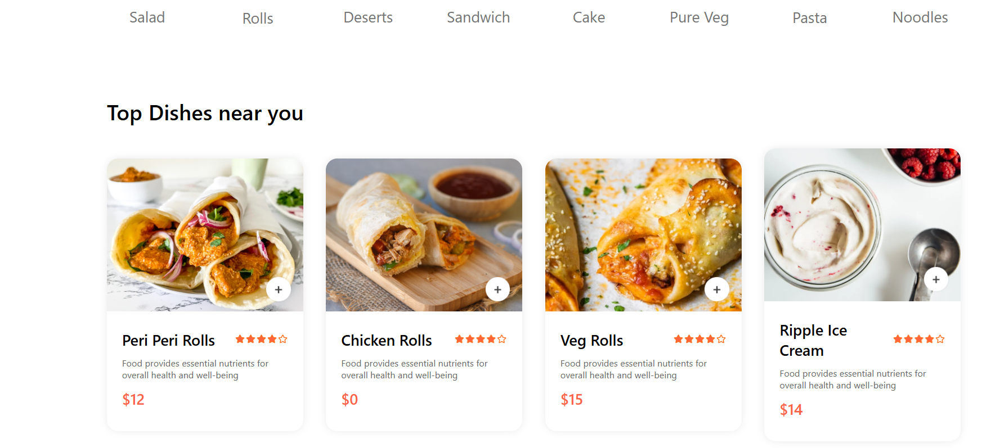
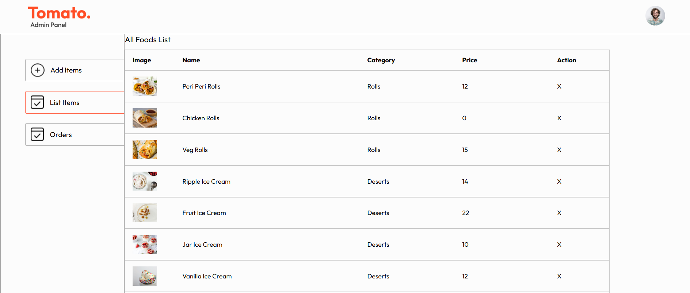

# Food Delivery App

A full-stack food delivery application with **Frontend**, **Backend**, and **Admin Panel**.  
This project allows users to browse restaurants, place orders, and for admins to manage the platform efficiently.

---

## Table of Contents

1. [Project Overview](#project-overview)  
2. [Features](#features)  
3. [Technologies Used](#technologies-used)  
4. [Folder Structure](#folder-structure)  
5. [Installation & Setup](#installation--setup)  
8. [Screenshots](#screenshots)  
9

---

## Project Overview

This Food Delivery App is designed to provide a seamless experience for both users and admins:

- Users can browse restaurants, menus, and place orders.  
- Admins can manage restaurants, menus, and track orders.  
- Full-stack solution with professional structure using modern web development best practices.

---

## Features

### Frontend (User Interface)
- Browse restaurants and dishes  
- Add items to cart and place orders  
- Responsive design for desktop and mobile  
- Interactive UI with smooth navigation  

### Backend (API Server)
- RESTful API for frontend  
- User authentication and authorization  
- CRUD operations for restaurants, menus, and orders  
- Secure handling of user data  

### Admin Panel
- Manage restaurants, menus, and orders  
- Track delivery status  
- View analytics and reports  

---

## Technologies Used

### Frontend
- React  
- CSS  
- Axios for API requests  

### Backend
- Node.js / Express  
- MongoDB  
- JWT for authentication  

### Admin Panel
- React  
- Admin dashboard libraries (e.g., Ant Design, Material UI)  

---

## Folder Structure

food-delivery-app/
├── frontend/ # User interface
├── backend/ # API server
└── admin/ # Admin panel

---

## Installation & Setup

### Backend

cd backend
npm install
npm run dev

 ### Frontend
cd frontend
npm install
npm start

 ### Admin-Panel
cd admin
npm install
npm start

THIS IS THE LINK >>>https://food-eco-frontend.onrender.com<<<

**Frontend**

**Admin Panel**

